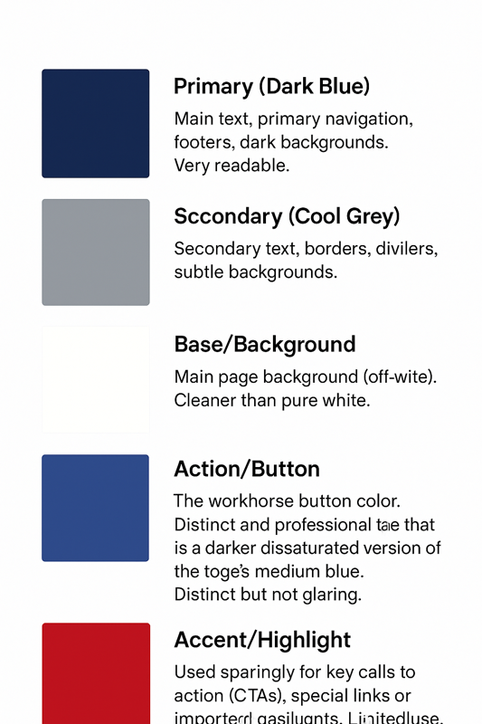

| **Color Name**          | **Hex Code** | **Purpose** |
|--------------------------|--------------|--------------|
| Primary (Dark Blue)      | `#192A56`    | Main text, primary navigation, footers, dark backgrounds. Very readable. |
| Secondary (Cool Grey)    | `#8D99AE`    | Secondary text, borders, dividers, subtle backgrounds. |
| Base/Background          | `#F8F9FA`    | Main page background (off-white). Cleaner than pure white. |
| Action/Button            | `#436098`    | The workhorse button color. Distinct and professional blue that is a darker, desaturated version of the logo's medium blue. Distinct but not glaring. |
| Accent/Highlight         | `#CE1F2C`    | Used sparingly for key calls to action (CTAs), special links, or important highlights. Limited use. |
